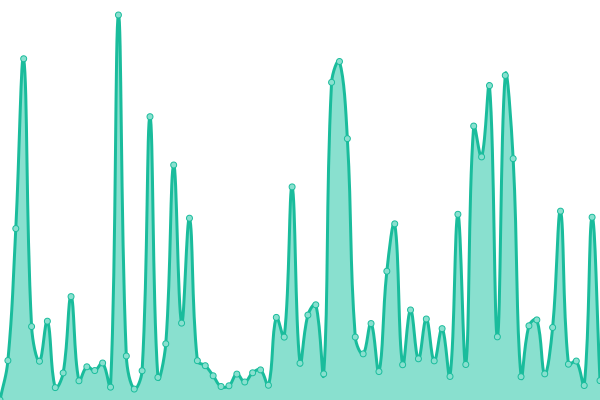

# [📈 Live Status](https://status.cuetconnect.org): <!--live status--> **🟩 All systems operational**

This repository contains the open-source uptime monitor and status page for [MD. ABU SAYED](https://abusayed.dev), powered by [Upptime](https://github.com/upptime/upptime).

With [Upptime](https://upptime.js.org), you can get your own unlimited and free uptime monitor and status page, powered entirely by a GitHub repository. We use [Issues](https://github.com/abusayed0206/cuetconnect-statuspage/issues) as incident reports, [Actions](https://github.com/abusayed0206/cuetconnect-statuspage/actions) as uptime monitors, and [Pages](https://status.cuetconnect.org) for the status page.

<!--start: status pages-->
<!-- This summary is generated by Upptime (https://github.com/upptime/upptime) -->
<!-- Do not edit this manually, your changes will be overwritten -->
<!-- prettier-ignore -->
| URL | Status | History | Response Time | Uptime |
| --- | ------ | ------- | ------------- | ------ |
|  [CUETCONNECT(MainSite)](https://cuetconnect.org/) | 🟩 Up | [cuetconnect-main-site.yml](https://github.com/cuetconnect/statuspage/commits/HEAD/history/cuetconnect-main-site.yml) | 

 1099ms
     
 | 

<a href="https://status.cuetconnect.org/history/cuetconnect-main-site">81.39%</a>
    

|  [CUETCONNECT(AdmissionSite)](https://admission.cuetconnect.org/) | 🟩 Up | [cuetconnect-admission-site.yml](https://github.com/cuetconnect/statuspage/commits/HEAD/history/cuetconnect-admission-site.yml) | 

 2720ms
     
 | 

<a href="https://status.cuetconnect.org/history/cuetconnect-admission-site">81.69%</a>
    

|  [CUETCONNECT(NoticesSite)](https://notices.cuetconnect.org/) | 🟩 Up | [cuetconnect-notices-site.yml](https://github.com/cuetconnect/statuspage/commits/HEAD/history/cuetconnect-notices-site.yml) | 

 1745ms
     
 | 

<a href="https://status.cuetconnect.org/history/cuetconnect-notices-site">83.35%</a>
    

<!--end: status pages-->

[**Visit our status website →**](https://status.cuetconnect.org)

## 📄 License

- Powered by: [Upptime](https://github.com/upptime/upptime)
- Code: [MIT](./LICENSE) © [MD. ABU SAYED](https://abusayed.dev)
- Data in the `./history` directory: [Open Database License](https://opendatacommons.org/licenses/odbl/1-0/)
