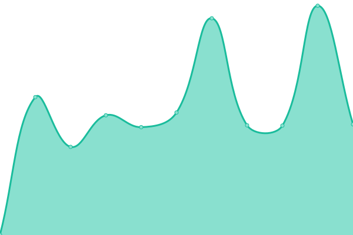

# [📈 Live Status](https://status.cuetconnect.org): <!--live status--> **🟩 All systems operational**

This repository contains the open-source uptime monitor and status page for [MD. ABU SAYED](https://abusayed.dev), powered by [Upptime](https://github.com/upptime/upptime).

With [Upptime](https://upptime.js.org), you can get your own unlimited and free uptime monitor and status page, powered entirely by a GitHub repository. We use [Issues](https://github.com/abusayed0206/upptime/issues) as incident reports, [Actions](https://github.com/abusayed0206/upptime/actions) as uptime monitors, and [Pages](https://status.cuetconnect.org) for the status page.

<!--start: status pages-->
<!-- This summary is generated by Upptime (https://github.com/upptime/upptime) -->
<!-- Do not edit this manually, your changes will be overwritten -->
<!-- prettier-ignore -->
| URL | Status | History | Response Time | Uptime |
| --- | ------ | ------- | ------------- | ------ |
|  [CUETCONNECT🌺(Main)](https://cuetconnect.org/) | 🟩 Up | [cuetconnect-main.yml](https://github.com/abusayed0206/cuetconnect-statuspage/commits/HEAD/history/cuetconnect-main.yml) | 

 396ms
     
 | 

<a href="https://status.cuetconnect.org/history/cuetconnect-main">100.00%</a>
    

|  [CUETCONNECT🌺(Forum)](https://forum.cuetconnect.org/) | 🟩 Up | [cuetconnect-forum.yml](https://github.com/abusayed0206/cuetconnect-statuspage/commits/HEAD/history/cuetconnect-forum.yml) | 

 866ms
     
 | 

<a href="https://status.cuetconnect.org/history/cuetconnect-forum">100.00%</a>
    

|  [CUETCONNECT🌺(Admission)](https://admission.cuetconnect.org/) | 🟩 Up | [cuetconnect-admission.yml](https://github.com/abusayed0206/cuetconnect-statuspage/commits/HEAD/history/cuetconnect-admission.yml) | 

 304ms
     
 | 

<a href="https://status.cuetconnect.org/history/cuetconnect-admission">100.00%</a>
    

|  [CUETCONNECT🌺(Notices)](https://notices.cuetconnect.org/) | 🟩 Up | [cuetconnect-notices.yml](https://github.com/abusayed0206/cuetconnect-statuspage/commits/HEAD/history/cuetconnect-notices.yml) | 

 190ms
     
 | 

<a href="https://status.cuetconnect.org/history/cuetconnect-notices">100.00%</a>
    

<!--end: status pages-->

[**Visit our status website →**](https://status.cuetconnect.org)

## 📄 License

- Powered by: [Upptime](https://github.com/upptime/upptime)
- Code: [MIT](./LICENSE) © [MD. ABU SAYED](https://abusayed.dev)
- Data in the `./history` directory: [Open Database License](https://opendatacommons.org/licenses/odbl/1-0/)
